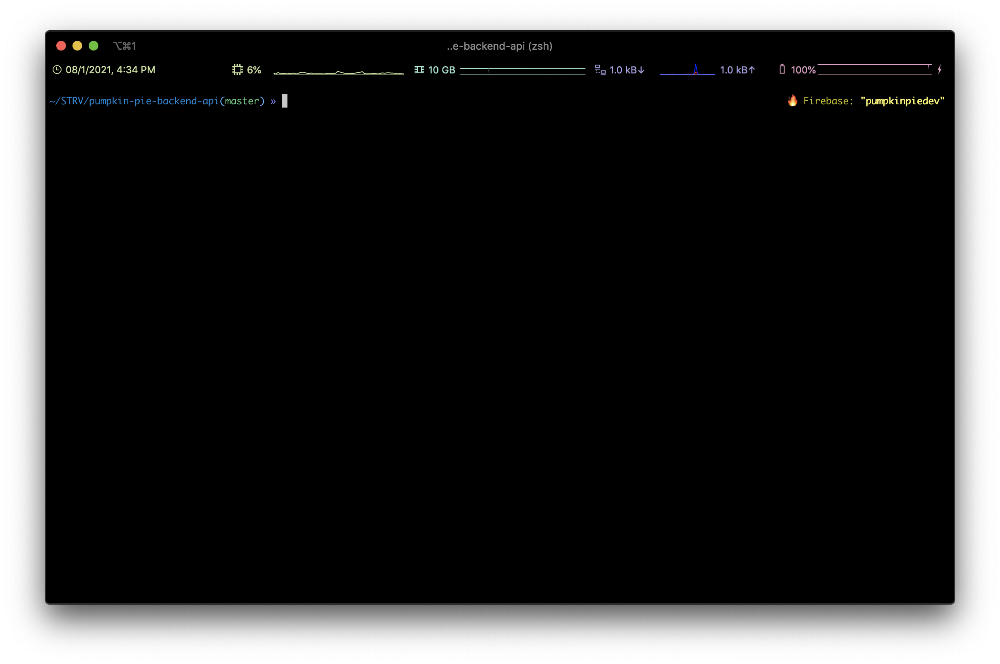

# zsh-firebase-prompt
> A simple shell utility to show active Firebase project in your command line

***Note:** This script uses [jq library](https://stedolan.github.io/jq/download/). Make sure you have it installed for the correct working.*



## Setup
1. Copy the code from `firebase_prompt.sh` to your `~/.zshrc` file or put it to the same directory and use

```
# .zshrc

source ./firebase_prompt.sh
```

2. Configure `RPROMPT` variable in `.zshrc` file
```
# .zshrc

RPROMPT='$(firebase_prompt)'
```

3. Reload the configuration file from command line

```
$ source ~/.zshrc
```

4. Enjoy 🎉